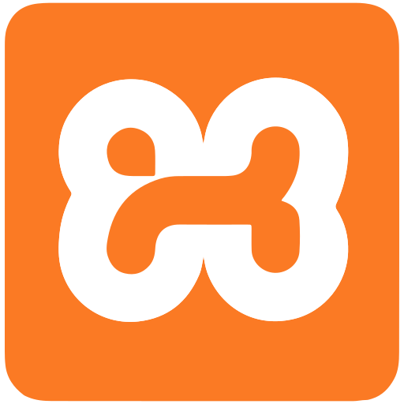
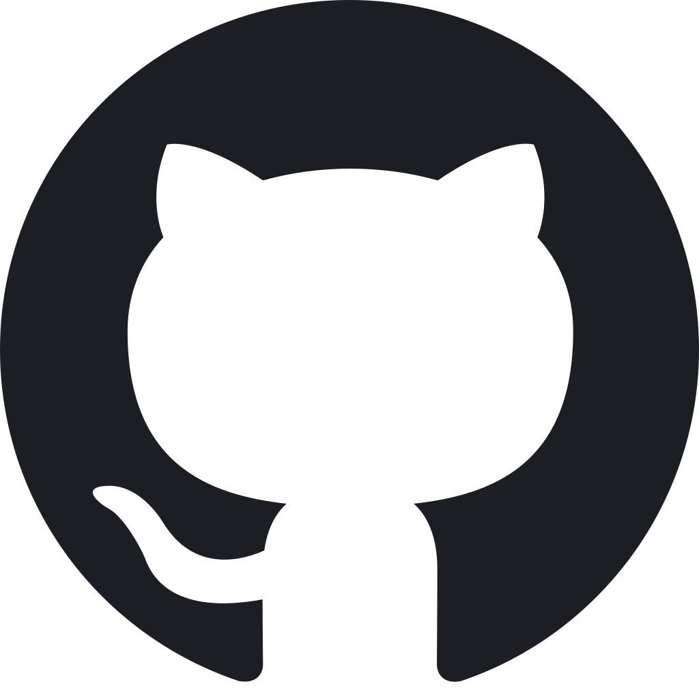
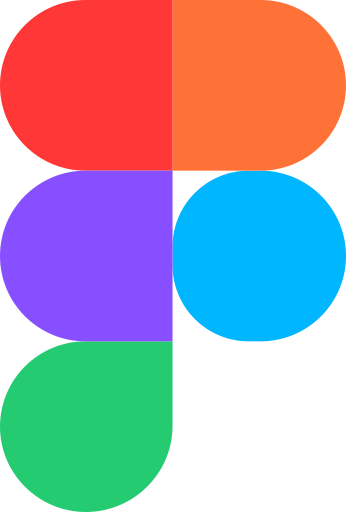
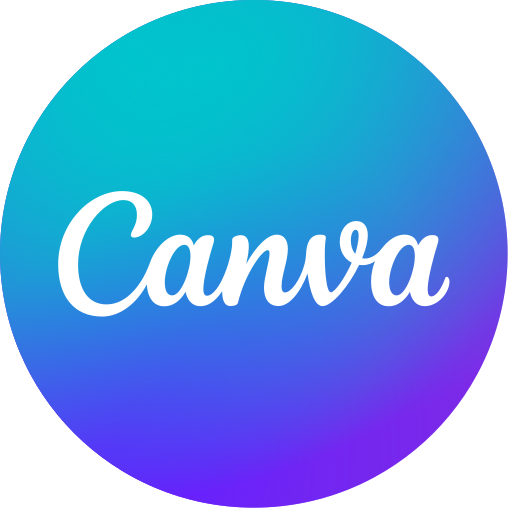
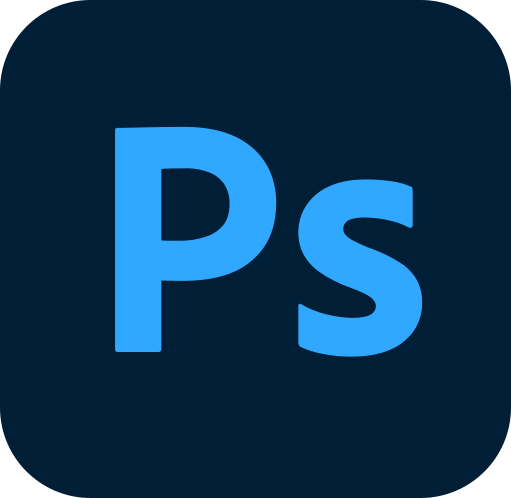
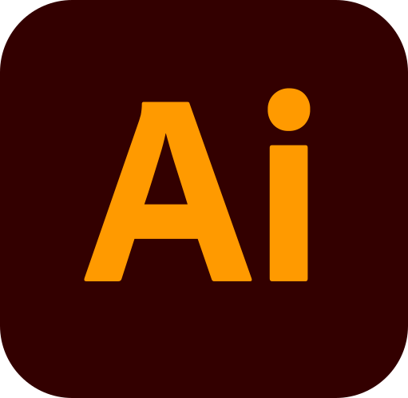
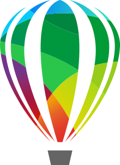

<picture>
  <source media="(prefers-color-scheme: dark)" srcset="assets/hero.svg" />
  <source media="(prefers-color-scheme: light)" srcset="assets/hero-light.svg" />
  
</picture>

 

I am an **Informatics student** interested in **technology**, **design**, and **building digital projects**. I enjoy exploring new things and combining programming skills with visual creativity. I am based in **Sumenep, Indonesia**, and currently studying **Informatics Engineering** at **Wiraraja University**. I am **open to collaboration** and **new opportunities** to work together.

 

 

## GitHub Activity

<picture>
  <source media="(prefers-color-scheme: dark)" srcset="https://streak-stats.demolab.com/?user=rtwone&exclude_days=Sun%2CMon%2CTue%2CWed%2CThu%2CFri%2CSat&short_numbers=true&hide_border=true&background=0A101F&stroke=22D3EE&ring=A78BFA&fire=10B981&currStreakLabel=22D3EE&sideLabels=94A3B8&currStreakNum=F8FAFC&sideNums=F8FAFC&dates=64748B&titleColor=22D3EE&card_width=1180" />
  
</picture>

 

<picture>
  <source media="(prefers-color-scheme: dark)" srcset="https://github-readme-stats-sigma-rosy-28.vercel.app/api?username=rtwone&show_icons=true&count_private=true&include_all_commits=true&hide_rank=true&hide_border=true&title_color=22D3EE&icon_color=A78BFA&text_color=94A3B8&bg_color=0A101F&card_width=500" />
  
</picture>
<picture>
  <source media="(prefers-color-scheme: dark)" srcset="https://github-readme-stats-sigma-rosy-28.vercel.app/api/top-langs/?username=rtwone&layout=compact&langs_count=8&hide_border=true&title_color=22D3EE&text_color=94A3B8&bg_color=0A101F&card_width=500" />
  
</picture>

 

## Technical Skills

<table border="0" cellpadding="7" cellspacing="5">
  <tr>
    <td bgcolor="#FFFFFF" style="border: 2px solid #111111; border-radius: 8px;"></td>
    <td bgcolor="#FFFFFF" style="border: 2px solid #111111; border-radius: 8px;"></td>
    <td bgcolor="#FFFFFF" style="border: 2px solid #111111; border-radius: 8px;"></td>
    <td bgcolor="#FFFFFF" style="border: 2px solid #111111; border-radius: 8px;"></td>
    <td bgcolor="#FFFFFF" style="border: 2px solid #111111; border-radius: 8px;"></td>
    <td bgcolor="#FFFFFF" style="border: 2px solid #111111; border-radius: 8px;"></td>
    <td bgcolor="#FFFFFF" style="border: 2px solid #111111; border-radius: 8px;"></td>
    <td bgcolor="#FFFFFF" style="border: 2px solid #111111; border-radius: 8px;"></td>
    <td bgcolor="#FFFFFF" style="border: 2px solid #111111; border-radius: 8px;"></td>
  </tr>
  <tr>
    <td bgcolor="#FFFFFF" style="border: 2px solid #111111; border-radius: 8px;"></td>
    <td bgcolor="#FFFFFF" style="border: 2px solid #111111; border-radius: 8px;"></td>
    <td bgcolor="#FFFFFF" style="border: 2px solid #111111; border-radius: 8px;"></td>
    <td bgcolor="#FFFFFF" style="border: 2px solid #111111; border-radius: 8px;"></td>
    <td bgcolor="#FFFFFF" style="border: 2px solid #111111; border-radius: 8px;"></td>
    <td bgcolor="#FFFFFF" style="border: 2px solid #111111; border-radius: 8px;"></td>
    <td bgcolor="#FFFFFF" style="border: 2px solid #111111; border-radius: 8px;"></td>
  </tr>
</table>

 

## Contribution Activity

<picture>
  <source media="(prefers-color-scheme: dark)" srcset="https://raw.githubusercontent.com/rtwone/rtwone/output/snake-dark.svg" />
  <source media="(prefers-color-scheme: light)" srcset="https://raw.githubusercontent.com/rtwone/rtwone/output/snake-light.svg" />
  
</picture>

---

Open to thoughtful collaborations and useful ideas.

